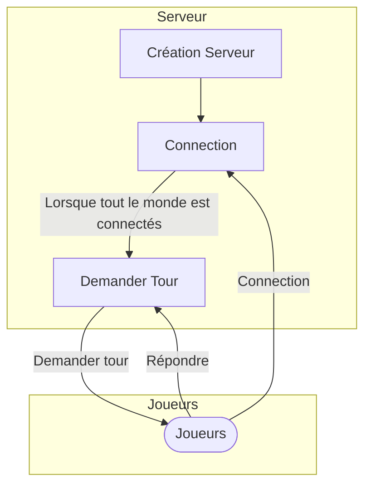

# Serveur HTTP du Défi d'Avril

## Utilisation : Noeuds HTTP



- **Connection :** `GET`, `<serveur>/connection`
  
  ```json
  {
    "nom":"<nom>",
    "adresse":"<domaine>:<port>" // Adresse de retour. Ex. : 127.0.0.1:8000
  }
  ```

  - **Réponse :**
  
    ```json
    {
        "jeton":"base64(nom:date_unix)"
    }
    ```

- **Jouer un tour** `PUT`, `<joueur>/tour`, `Authorization: Bearer <jeton>`
  
  ```json
  {
    "erreurs":[ // Liste des erreurs du serveur du dernier tours
        "<message>",
        "<message>",
        ...
    ],
    "joueurs":[/*Liste des noms des joueurs*/],
    "joueurs_infos":{
        "<nom_joueur>":{
            "points":"<int>", // Points totaux du joueur
            "points_obtenus":"<int>", // Points obtenus dans le dernier tour
            "action":[true,false], // Action prise dans le dernier tour. True = A collaboré, False = A trahis
        },
        ...
    }
  }
  ```
  
  - **Réponse :**
  
    ```json
    {
        "action":[true,false] // True = Collaborer, False = Trahir
    }
    ```

- **Tester la connection :** `GET`, `<joueur>/ping`
  
  Après la connection (`<serveur>/connection`), le serveur tentra d'établir la connection avec l'adresse fournie.

  - **Réponse :**
    
    ```json
    {"réponse":"pong"}
    ```