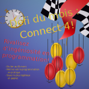

Défi de Mars
==============

```
   ____       ____      __     __    __     __     ____      ___    _______      _    _ 
  / __ \     / __ \    |  \   |  |  |  \   |  |   / __ \    / _ \  |__   __|    | |  | |
 / /  \_)   / /  \ \   |   \  |  |  |   \  |  |  ( (  \/   / / \_)    | |       | |__| |
| |        | |    | |  | |\ \ |  |  | |\ \ |  |   \ \__   | |         | |       |____  |
| |    _   | |    | |  | | \ \|  |  | | \ \|  |   / /  __ | |   __    | |            | |
 \ \__/ )   \ \__/ /   | |  \    |  | |  \    |  ( (__/ /  \ \_/ /    | |            | |
  \____/     \____/    |_|   \___|  |_|   \___|   \____/    \___/     |_|            |_|
```

Le défi du mois de mars a pour thème : Connect 4!

Vous pouvez voir le classemement actuel [ici](./Soumissions.md)

Le Défi du Mois
-----------------

Le ***Défi du Mois*** est un défi de programmation compétitif dans lequel vous aurez à construire un programme qui répond à certains critères. Vous soumetterez votre solution et elle serat jugée selon divers critères et la meilleure solution sera courronnée gagnante du défi. Soumettez vos solution à <uqode@uqo.ca>.



Les règles du jeu : 
----------------------

Connect 4 est un jeu de table à deux joueurs. Les joueurs font face à une grille de 7x6 qui se tient debout sur la table. Des jetons sont inséré par le haut de la grille et tombent jusqu'au fond ou sur les jetons dessous, s'il y en a déjà. Les joueurs insèrent des jetons à tour de rôle et le premier qui en connecte 4 en ligne droite gagne. Les lignes horizontales, verticales et diagonales sont acceptées.

Plus d'informations sont disponibles [ici](https://fr.wikipedia.org/wiki/Puissance_4)

Les règles du défi : 
-----------------------

Soumettez vos solutions à <uqode@uqo.ca>.

- Faites un programme pour jouer au connect 4, tel que décrit ci-haut, dans le langage de programmation de votre choix.
- Les équipes sont permises. Informez-nous en clairement, s'il-vous plaît.
- Fournissez le code source de votre soumission.
- Fournissez une documentation claire et précise pour exécuter et/ou compiler votre programme. 
    - **TESTEZ CES INSTRUCTIONS SUR UN COLLÈGUE ET UNE MACHINE VIERGE AVANT DE SOUMETTRE.** 
    - Si les instructions ne fonctionnent pas, nous vous contacterons et nous vous donnerons une et une seule chance. Nous ne déboguerons pas votre programme.
    - Indice : Utilisez une machine virtuelle pour tester l'exécution de votre programme.
- Les instructions doivent permettre d'exécuter votre programme sur une machine Windows et GNU-Linux.
- Pour les soumissions par une plateforme git, nous prendrons la branche principale comme et le commit le plus récent avant la date limite comme étant la soumission. Toute modification après la date limite sera ignorée.
- Votre soumission doit être le produit de vos efforts. Le plagiat et la fraude sont interdits. Voir [notre politique d'intégrité des soumissions](#politique-dintégrité-des-soumissions-).
- La génération de code par l'intelligence artificielle est interdite. Voir [notre politique d'intégrité des soumissions](#politique-dintégrité-des-soumissions-).

**Votre soumission sera publiée à tous, assurez-vous de ne pas inclure des informations sensibles!**

Les critères de jugement : 
------------------------------

**Toute soumission qui ne respecte pas les règles ou le thème sera éliminée.**

- *Qualité du code.* Soumettez un code clair, maintenable et documenté qui respecte les bonnes pratiques.
- *Expérience utilisateur.* Assurez-vous d'avoir de bonnes performances, une interface intuitive et des contrôles efficaces.
- *L'originalité de la solution.* Vous êtes encouragés à dépasser la description du thème, tout en restant dans l'esprit du défi proposé.
- Bien que les dépendances soient permises, plus une solution en contient, moins elle sera jugée favorablement.

Politique d'intégrité des soumissions : 
------------------------------------------

- Votre soumission doit être le fruit de votre propre travail.
    - L'utilisation du travail d'autrui n'est autorisé que si l'auteur original permet une telle utilisation et est correctement et clairement cité.
    - Le travail d'autrui ne peut pas composer plus de 30% de votre soumission (ceci exclut les composantes intégrées de votre langage).
    - L'utilisation de bibliothèques sera traitée au cas par cas. Assurez-vous que votre soumission demeure en esprit le fruit de votre travail et que la bibliothèque ne fasse pas le travail à votre place. Nous vous avertirons d'avance de notre jugement et vous donnerons une chance de rectifier le tir.
- La génération de code à l'aide de l'intelligence artificielle est interdite.
    - Si nous soupçonnons de la génération à l'intelligence artificielle, vous pourrez être disqualifiés.
    - Nous vous avertirons d'avance et vous donnerons la chance de prouver que votre travail n'a pas utilisé l'intelligence artificielle. Nous fonctionnerons sur un principe de la prépondérance de la preuve.
    - L'utilisation de l'IA à toute autre fin est permise.
- Du code copié d'un autre auteur doit être correctement et clairement cité dans le format suivant : 

    ```C++
    //  +--- Caractère de commentaire de votre langage
    //  |
    //  V
        // =====================================================================
        // Merci à <Nom de l'auteur> pour <Description du code copié> (Optionel)
        // Source : <Nom/pseudo de l'auteur>, <date d'obtention>, <URL vers la source>
        // Licence : <Nom de licence> <URL vers la licence> (S'il y a lieu)
        // =====================================================================

        void fonction_exemple(){
            // Code copié
        }

        // =================================
        // Fin du code de <Nom/pseudo de l'auteur>
        // =================================
    ```

    - Ceci inclut toute solution copiée-collée de StackOverflow, Reddit ou autre. L'intelligence artificielle et le résumé google ne sont pas citables et ne sont pas des sources.
    - Si nous soupçonnons du plagiat, vous pourrez être disqualifié.