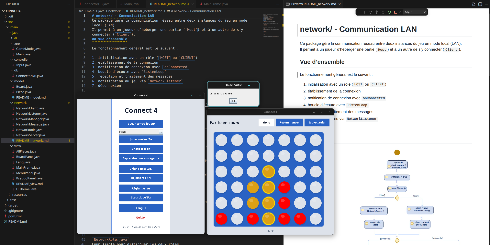

# Soumissions au Défi de Mars 2025

Les soumissions sont ordonnées dans l'ordre des gagnants

1. 🏆 **Tanjon'Yavo Ramiandrisoa** [*(Github)*](https://github.com/Tanjonyavo/connect4)

    

    Avec une soumission époustouflante combinant documentation et architecture exemplaire, **Tanjon'Yavo** remporte la palme haut la main en offrant une liste de fonctionnalités longue comme le bras, incluant : 

    - Un jeu de *Connect 4* complet avec interface utilisateur en *Java Swing* qui ne fait pas saigner des yeux,
    - Un mode de jeu à deux joueurs, et un mode en LAN
    - Un mode de jeu contre l'ordinateur comportant 4 niveaux de difficultés : `FACILE`, `MOYEN`, `EXPERT` et `IMPOSSIBLE` *(Arriverez-vous à le battre?) 🔥*
    - Une persistance du programme faisant usage d'une base de données SQLite
    - Des statistiques de jeu contre l'ordinateur
    - Des secrets à débloquer en abattant l'ordinateur 👀!